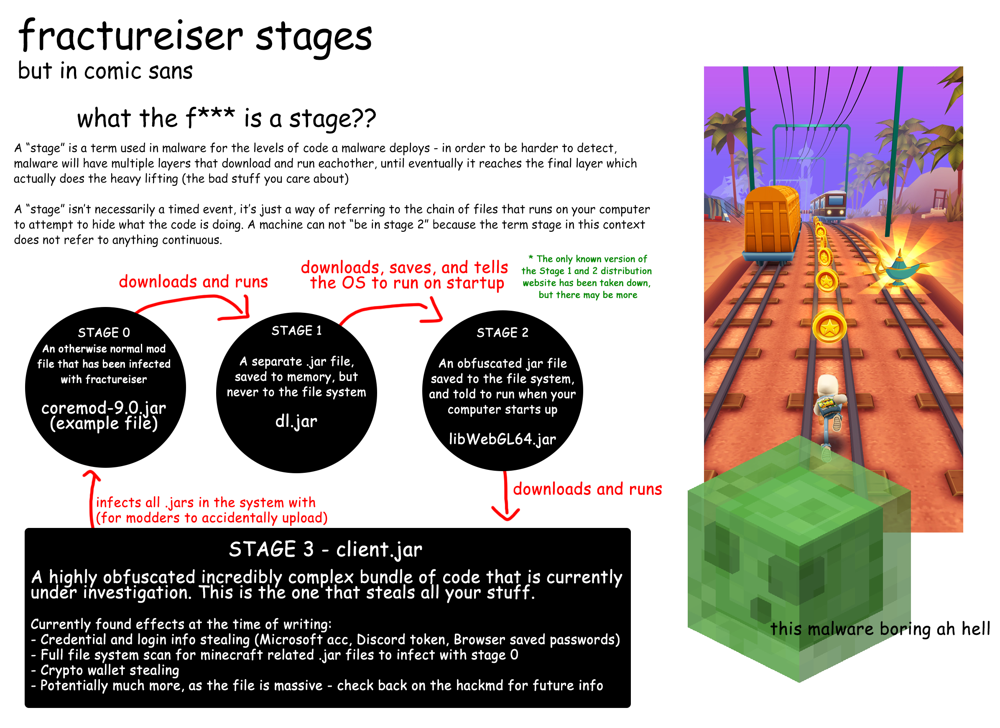
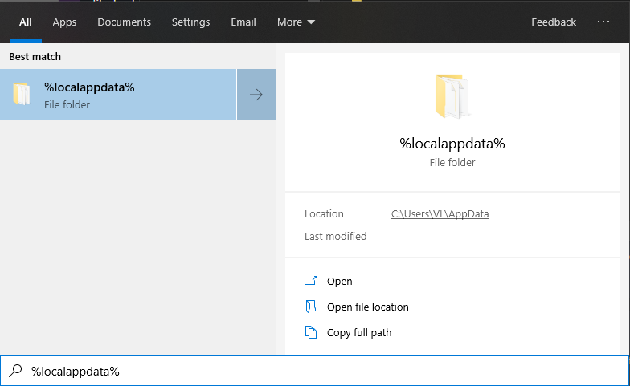

# Modded Players Guide

If you **only** play vanilla through a trusted launcher such as the official launcher or
Prism, and have never touched mods ever: you are 100% safe. Stay away from mods for the
time being.

If you're a Modded Minecraft player, you need to verify if you have been infected by the
fractureiser malware to ensure your machine and personal data are not at risk. You can do
so with the instructions below.

Additional info on what to do if you are or are not infected will also be provided after the diagnostic steps.

## What Actually Happened?

A number of Curseforge and dev.bukkit.org (not the Bukkit software itself) accounts were compromised, and malicious software was injected into copies of many popular plugins and mods. Some of these malicious copies have been injected into popular modpacks including Better Minecraft. *There are reports of malicious plugin/mod JARs as early as mid-April.*

This malware is composed of multiple "stages", each Stage is responsible for downloading
and running the next one. In total, there are three known Stages (Stages 1, 2, and 3),
with infected mod files serving as a "Stage 0" to kick the whole process off.

Stage 3 is the "mastermind" of the malware, and we have evidence that it attempts to do all of the following:

* Propagate itself to *all* `jar` files on the filesystem, possibly infecting mods that
  were not downloaded from CurseForge or BukkitDev, or other Java programs
* Steal cookies and login information for many web browsers
* Replace cryptocurrency addresses in the clipboard with alternates that are presumably owned by the attacker
* Steal Discord credentials
* Steal Microsoft and Minecraft credentials

(See [technical details](tech.md) for more info)

Because of its behavior, we are **very confident** this is a **targeted attack against the modded Minecraft ecosystem**. It's quite bad.

**Until further notice, exercise extreme caution with Minecraft mod downloads, regardless
of origin.** While the control server for this malware is currently offline, **any
download from Curseforge or the Bukkit plugin repository in the last 2-3 weeks should be
treated as potentially malicious**. Some malware scanners have started adding signatures
to their databases, but until this rolls out to all of them, please exercise caution.

*At this point we cannot be confident claiming any hosting service is unaffected*. Please
exercise caution regardless of what site you use. Even Maven repositories may be infected,
and this malware goes back months.

Currently, new infections are impossible as the attacker's server has been shut down,
existing infections may still be active.

### What the f*** is a Stage?



## Am I Infected?

The malware has multiple stages, so asking whether you are infected is actually two questions

### Do any of my mod files have Stage 0?
A variety of scanners exist that take a mod file and detect whether it is infected by Stage 0 of the malware.

- Overwolf's [scanner](https://github.com/overwolf/detection-tool/releases)
- douira's [web scanner](https://douira.github.io/fractureiser-web-detector/)

### Are Stage 2 files present on my system?

You can check if Stage 2 files are present on your system (implying stage 0 and 1 of the
malware ran successfully) by doing the following.

#### Windows Instructions

* Open your Start menu with the Windows Key, and type `%localappdata%` - it should appear as such:


* Inside the Local appdata folder, you must ensure that your Explorer is set to view both `Hidden Items`, and `Protected Operating System Files`. 
  * This can be done from View > Options
  * If you are unsure how to do this, a video explanation [can be found here](https://youtu.be/KLTlTlnXeKs).


* Locate a folder named `Microsoft Edge`. The SPACE between "Microsoft" and "Edge" is important - as `MicrosoftEdge` is a legitimate folder that is used by Edge. The virus simply named it like that to disguise itself.
* If `Microsoft Edge` is present, you were infected. If this is the case, permanently delete the folder and everything inside it.
  * If the folder can not be deleted, you must stop any Java programs currently running via your Task Manager.

#### Linux Instructions

Firstly, ensure whichever method you are using to list files has the ability to view hidden files. Most GUI file managers have the shortcut Ctrl+H to toggle hidden files. If doing this on a terminal, use `ls -A` in the respective directories, or `ls -lha` for a more detailed listing.

If any of the following files exist, you were infected. If this is the case, delete all of them:
* `~/.config/systemd/user/systemd-utility.service`
* `/etc/systemd/system/systemd-utility.service`
* `~/.config/.data/lib.jar`

Upon doing so, if applicable, check your `journalctl` for any changes you may not recognize. You can do this with the commands `journalctl -exb` (for system logs) and `journalctl -exb --user` (for user logs). Run the following commands to refresh your systemd services:
```sh
sudo systemctl daemon-reload # Enter your user password
systemctl --user daemon-reload 
```

#### MacOS Information

The malware does not seem to affect MacOS, so you should be fine. *Recheck this doc in the future if this changes*

#### Scripts

*If you don't know how to run a PowerShell or Bash script, these are not for you.*  
Automated PowerShell or Bash scripts are also available [on the PrismLauncher
website](https://prismlauncher.org/news/cf-compromised-alert/#automated-script) to check
for Stage 2 for you, if you have the technical knowhow to run them. Overwolf (Curseforge's
parent company) has also released a C# Stage 2 detection tool:
https://github.com/overwolf/detection-tool

## I'm Infected, Now What?

**IMPORTANT**: We do not currently know the full extent of everything this can do, nor what its intent is, so extreme caution should be exercised until a complete way to remove any symptoms is found. Everything stated here is only *what we know* - please keep an eye on communication from the team on updates if anything critical is found.

If you have been infected by fractureiser, your best option now is to assume everything on
the computer that was infected is *entirely compromised*. You should:

* Back up anything you do not want to lose on an a flash drive or external disk (you should be doing this regularly anyway!)
* Using a separate device, change the passwords to all services you were logged into on
  the old machine (Discord, email, etc.). Preferably using a password manager like
  [BitWarden](https://bitwarden.com).
* If you were not yet using Two-Factor Authentication (Authenticator app or SMS) for every service that supports it, please start doing so immediately
* If you are able to, contact a professional service in your area to run a proper
  diagnostic on your machine for anything suspicious, or as a safe default simply wipe and
  reinstall the system.
* Read the below section on what to do if you're not infected, as the steps there apply to you too.

## I'm Not Infected, Now What?

The absolute safest thing you can do at the moment is to **not launch Minecraft at all**. Yes, even Vanilla.  


With that said - if nothing was found in the first place, chances are there's nothing going on.
If you still want to play the game:

* With the current knowledge we have, this is not risky, but we do not guarantee this is accurate - you are *willingly putting yourself at risk*.
* After each session, check for the infection files in the previous step to ensure nothing has happened since
* Do not, under **any circumstances**, download or update any mods, modpacks, or plugins you may use, or even run any you downloaded and never ran before - stick to instances you have already used, and those **only**
